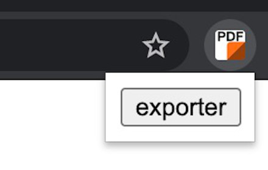

PDF Exporter for <a href="https://www.leboncoin.fr/">leboncoin.fr</a>




## 📖 Description

### 🇫🇷 Français

Exportez les annonces postées sur leboncoin.fr au format PDF.

Archivez les annonces qui suscitent votre intérêt.

Dites adieu aux annonces expirées que vous ne pouvez plus consulter.

### 🇬🇧 English

Export classified ads from leboncoin.fr in PDF format.

Archive ads that interest you.

Say goodbye to unavailable ads.

## 🚀 Download

 [**Chrome**](https://chrome.google.com/webstore/detail/pdf-exporter-for-leboncoi/mifkoblilhehppoemadbhopbbijpifcj)

 [**Firefox**](https://addons.mozilla.org/firefox/addon/leboncoin-pdf/)

## 🖊 Contribute

### Development environment

outputs in `dist`

```bash
# firefox
pnpm dev:firefox

# chrome
pnpm dev:chrome
```

### Build environment

outputs in `packages`

```bash
pnpm build
```
