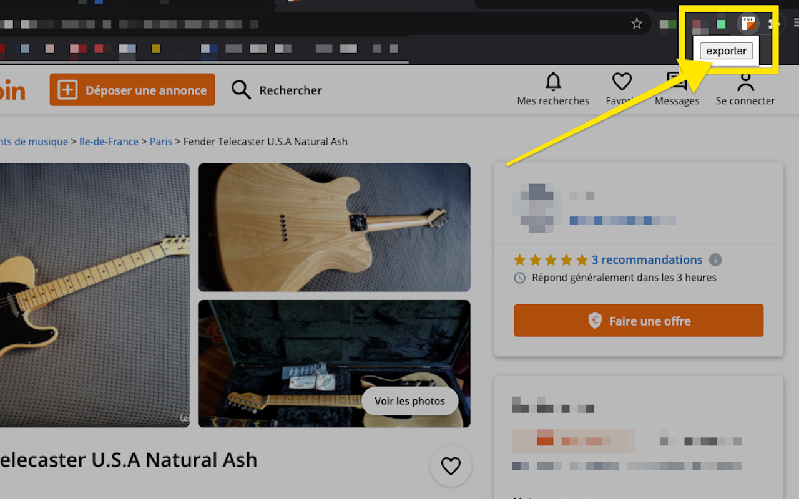
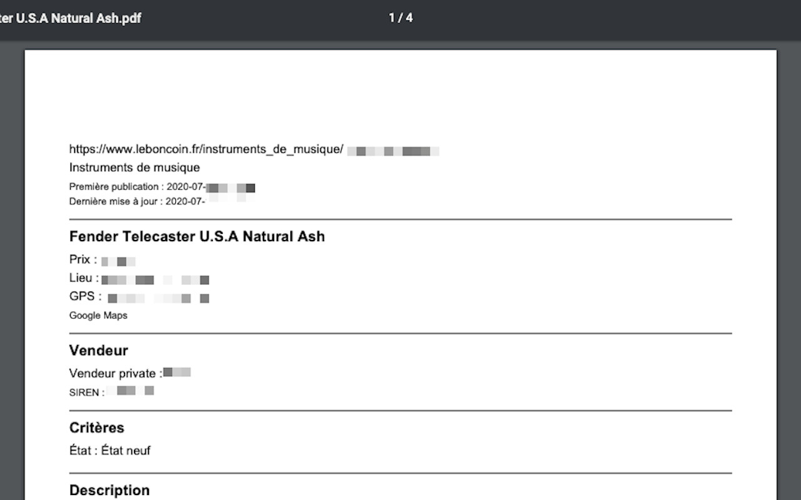
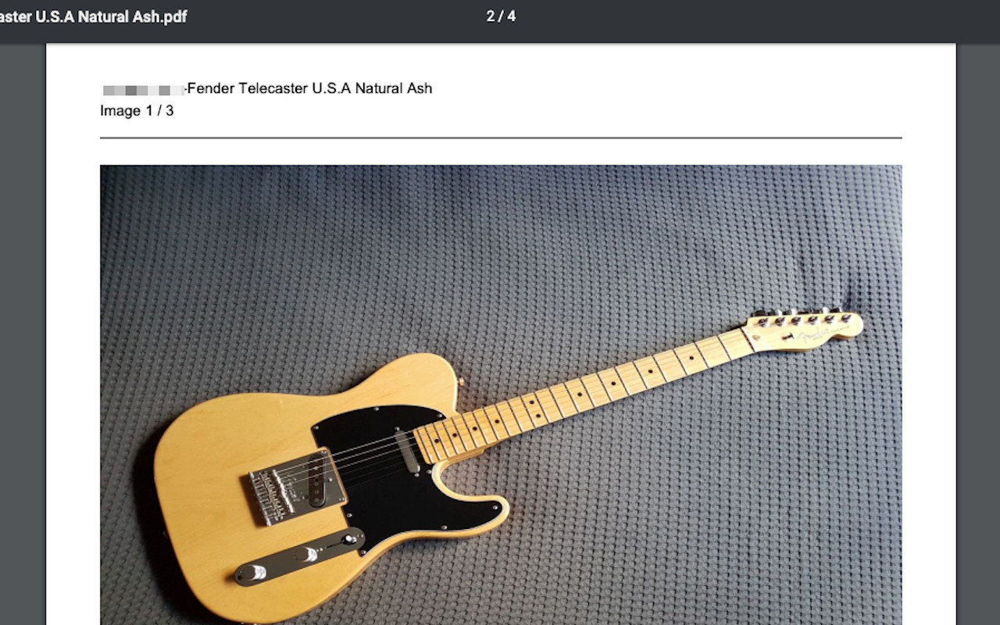

# [leboncoin-pdf-ext](https://github.com/bamdadsabbagh/leboncoin-pdf-ext)

PDF Exporter for  [**leboncoin.fr**](https://www.leboncoin.fr/)

## Context

This Web Extension allows you to export a classified ad from leboncoin.fr
in PDF format.

It is useful if you want to keep archives of certain ads,
thus making them available to you after their expiry on the actual website.

## Where to get

Web Extension available for:

-  [**chrome**](https://www.google.com/chrome/)

-  [**firefox**](https://www.mozilla.org/en-US/firefox/new/)
  - get [**here**](https://addons.mozilla.org/en-US/firefox/addon/leboncoin-pdf/)

## Screenshots

  
  
  

