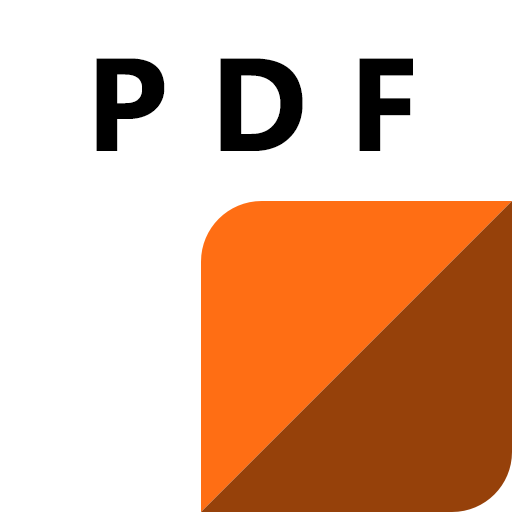

# [leboncoin-pdf-ext](https://github.com/bamdadsabbagh/leboncoin-pdf-ext)

PDF Exporter for  [**leboncoin.fr**](https://www.leboncoin.fr/)

## 🚀 Download

Web Extension available for:

- get for [ **chrome**](https://chrome.google.com/webstore/detail/pdf-exporter-for-leboncoi/mifkoblilhehppoemadbhopbbijpifcj)

  
  
  

- get for [ **firefox**](https://addons.mozilla.org/en-US/firefox/addon/leboncoin-pdf/)

  
  
  

## 📖 Context

This Web Extension allows you to export a classified ad from leboncoin.fr
in PDF format.

It is useful if you want to keep archives of certain ads,
thus making them available to you after their expiry on the actual website.

**No more outdated ad you can't access.**

## 📸 Screenshots

  
  
  

